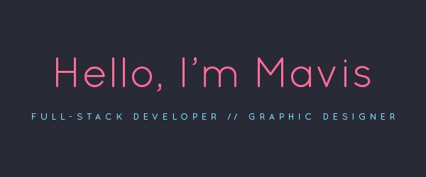

    
  
  

___

✨ Open for hire/commission  
💼 6-month Full-stack Developer at Singapore Airlines  
👩‍🎓️ 3-month Jr Full-stack Developer bootcamp by Generation Singapore
___

## 🖥️ Technologies & Tools
#### Languages
    

#### Frameworks, Platforms, and Libraries
     

#### Unit Testing
 

#### IDEs/Editors
  

#### Version Control
  

#### Operating System
   

#### Others
       

#### Design
       

___

## 🌱 What I'm learning/improving on
      

___

## 📊 Stats

 
